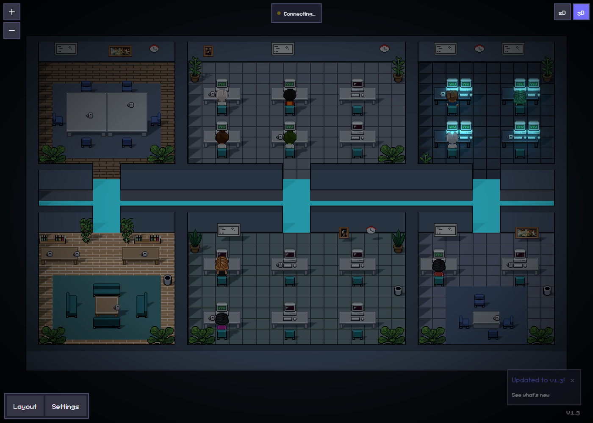
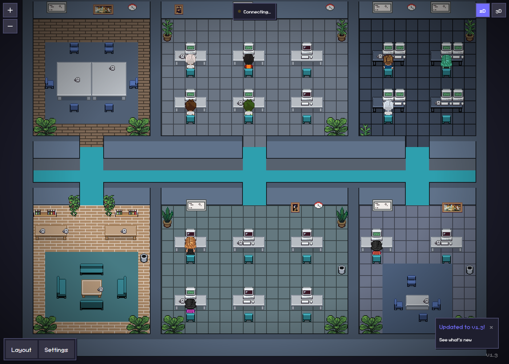
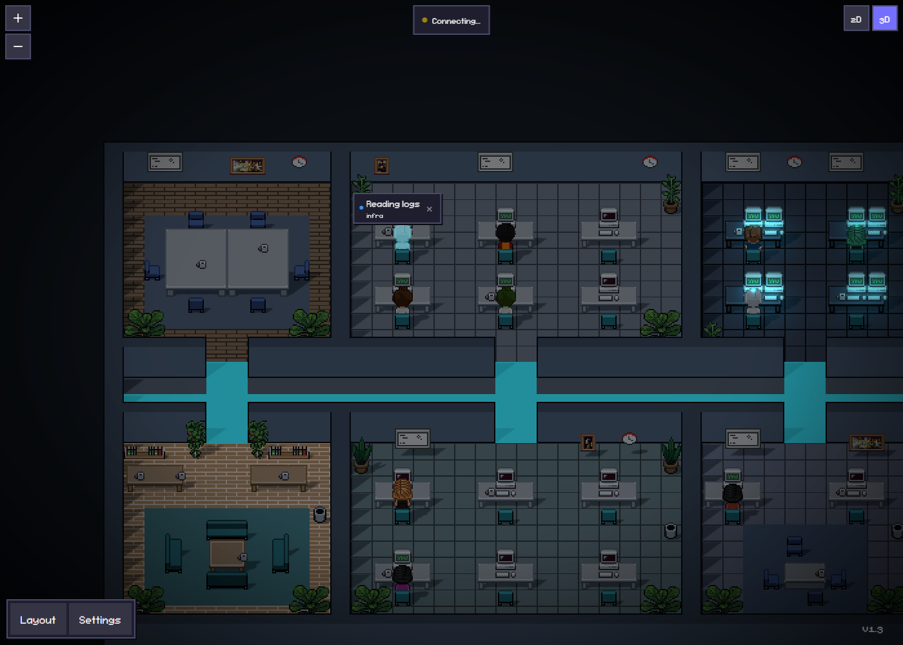

<h1 align="center">Pixel Agents · Smiith Edition</h1>

<p align="center">
  Escritório pixel art onde seus agentes Claude Code trabalham — agora com visão 3D iluminada
  e o layout <strong>Smiith Tech</strong> (40×30, grafite e ciano).
</p>

<p align="center">
  Fork de <a href="https://github.com/pixel-agents-hq/pixel-agents"><strong>Pixel Agents</strong></a>,
  criado por <a href="https://github.com/pablodelucca"><strong>Pablo De Lucca</strong></a>. Licença MIT.
</p>

<p align="center">
  
</p>

---

## O que este fork adiciona

|                              |                                                                                                                                                                                                                                                |
| ---------------------------- | ---------------------------------------------------------------------------------------------------------------------------------------------------------------------------------------------------------------------------------------------- |
| **Visão 3D**                 | Botão `2D \| 3D` no canto superior direito. Os mesmos sprites viram planos em uma cena Three.js com sombras reais, luz dos monitores e bloom. Clique, hover, troca de assento e câmera que segue o agente funcionam igual ao 2D.               |
| **Layout Smiith Tech**       | Escritório 40×30 com 18 estações: desenvolvimento (6), suporte / IA (6), operações / NOC (4, monitores duplos), atendimento e demos (2), sala de reunião e lounge com café. Um corredor grafite com trilhas de luz ciano liga todas as portas. |
| **Overlay animado**          | O painel de status do agente (atividade, time, uso de contexto) acompanha o personagem também no 3D e entra com animação (Motion). Respeita `prefers-reduced-motion`.                                                                          |
| **Carregamento sob demanda** | O 3D (~270 kB gzip) só é baixado quando você o abre. Quem fica no 2D não paga nada.                                                                                                                                                            |

O 3D fica desabilitado enquanto o editor de layout ou o tour inicial estão abertos — ambos dependem da projeção 2D.

<p align="center">
  
  
</p>

## Como rodar

Requisitos: Node.js 20+, [Claude Code CLI](https://docs.anthropic.com/en/docs/claude-code) instalado.

```bash
git clone https://github.com/OwSmiithDev/pixel-agents.git
cd pixel-agents
npm install
npm run build
```

**No navegador (standalone)** — rode a partir da pasta do projeto onde o Claude Code trabalha:

```bash
cd /caminho/do/seu/projeto
node /caminho/para/pixel-agents/dist/cli.js --port 3100
```

Abra a URL impressa (ela contém `?token=` — não compartilhe). Inicie o `claude` em outro terminal na mesma pasta.

**No VS Code** — abra esta pasta no VS Code e pressione **F5** para rodar a extensão em modo de desenvolvimento.

## Onde está cada coisa

| Caminho                                          | O quê                                                                 |
| ------------------------------------------------ | --------------------------------------------------------------------- |
| `webview-ui/src/office/three/`                   | Renderer 3D: câmera, chão, sprites, luzes, efeitos                    |
| `webview-ui/src/office/three/coords.ts`          | Mapeamento sprite 2D → mundo 3D (mantém a mesma oclusão do 2D)        |
| `webview-ui/src/office/engine/officeClick.ts`    | Lógica de clique compartilhada entre 2D e 3D                          |
| `webview-ui/src/constants.ts`                    | Cores e parâmetros do 3D (`THREE_*`) — ângulo de câmera, luzes, bloom |
| `scripts/layouts/smiith-tech.mjs`                | Gerador do layout Smiith Tech (salas como retângulos)                 |
| `webview-ui/public/assets/default-layout-2.json` | Layout gerado, usado como padrão                                      |
| `docs/superpowers/specs/`                        | Design e decisões técnicas                                            |

Para ajustar o layout, edite o gerador e rode `node scripts/layouts/smiith-tech.mjs`.

## Testes

```bash
cd webview-ui && npx vitest run   # interface, layout e coordenadas 3D
npm run build                     # tipos, lint e bundle
```

## Créditos

Este projeto é um fork de **[Pixel Agents](https://github.com/pixel-agents-hq/pixel-agents)**, criado e mantido por
**[Pablo De Lucca](https://github.com/pablodelucca)** e contribuidores. Toda a base — extensão VS Code, servidor
standalone, detecção de agentes por hooks, motor de personagens, editor de layout e arte pixel — é trabalho deles.
Este fork adiciona a visão 3D e o layout Smiith Tech por cima.

- README original do projeto: [docs/UPSTREAM_README.md](docs/UPSTREAM_README.md)
- Apoie o autor original: [GitHub Sponsors](https://github.com/sponsors/pablodelucca) · [Ko-fi](https://ko-fi.com/pablodelucca)
- Comunidade original: [Discord](https://discord.gg/Yk7jXebv9H) · [Discussions](https://github.com/pixel-agents-hq/pixel-agents/discussions)

Bugs do núcleo do Pixel Agents devem ser reportados no [repositório original](https://github.com/pixel-agents-hq/pixel-agents/issues);
problemas da visão 3D ou do layout Smiith Tech, [aqui](https://github.com/OwSmiithDev/pixel-agents/issues).

## Licença

[MIT](LICENSE) — Copyright (c) 2026 Pablo De Lucca. As modificações deste fork seguem a mesma licença.
