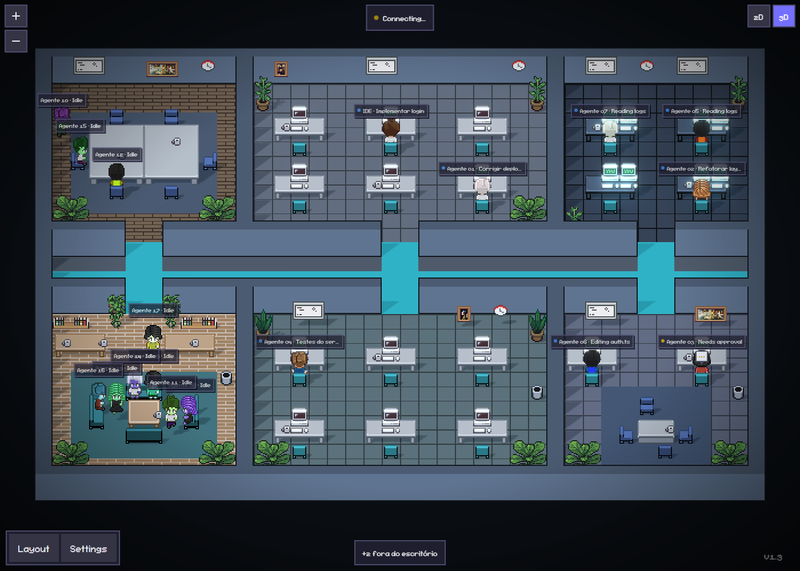
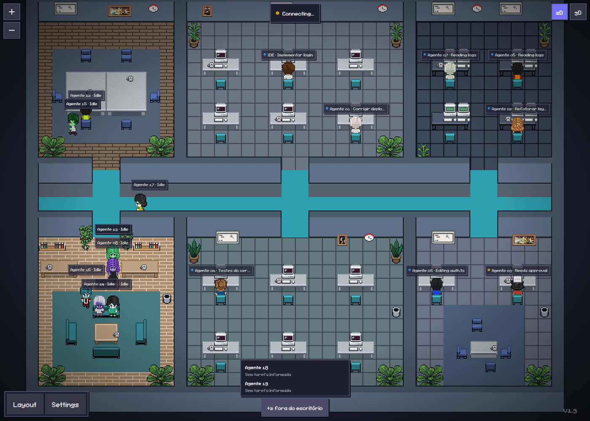

<h1 align="center">Pixel Agents · Smiith Edition</h1>

<p align="center">
  Escritório pixel art onde seus agentes Claude Code trabalham — com visão 3D iluminada,
  o layout <strong>Smiith Tech</strong> (40×30, grafite e ciano) e agentes que trabalham no PC
  e descansam no lounge, com o título da tarefa sobre a cabeça.
</p>

<p align="center">
  Fork de <a href="https://github.com/pixel-agents-hq/pixel-agents"><strong>Pixel Agents</strong></a>,
  criado por <a href="https://github.com/pablodelucca"><strong>Pablo De Lucca</strong></a>. Licença MIT.
</p>

<p align="center">
  
</p>

---

## O que este fork adiciona

|                              |                                                                                                                                                                                                                                                                                                                                                                                                                                                                          |
| ---------------------------- | ------------------------------------------------------------------------------------------------------------------------------------------------------------------------------------------------------------------------------------------------------------------------------------------------------------------------------------------------------------------------------------------------------------------------------------------------------------------------ |
| **Visão 3D**                 | Botão `2D \| 3D` no canto superior direito. Os mesmos sprites viram planos em uma cena Three.js com sombras reais, luz dos monitores e bloom. Clique, hover, troca de assento e câmera que segue o agente funcionam igual ao 2D.                                                                                                                                                                                                                                         |
| **Layout Smiith Tech**       | Escritório 40×30 com 18 estações: desenvolvimento (6), suporte / IA (6), operações / NOC (4, monitores duplos), atendimento e demos (2), sala de reunião e lounge com café. Um corredor grafite com trilhas de luz ciano liga todas as portas.                                                                                                                                                                                                                           |
| **Overlay animado**          | O painel de status do agente (atividade, time, uso de contexto) acompanha o personagem também no 3D e entra com animação (Motion). Respeita `prefers-reduced-motion`.                                                                                                                                                                                                                                                                                                    |
| **Órbita**                   | Terceiro modo do seletor (`2D \| 3D \| Órbita`). Câmera livre em volta do escritório, como num jogo: arraste para girar, botão direito para mover, roda para zoom, Q/E giram 90°, R volta. Paredes viram blocos que abaixam quando ficam na frente; mesas e sofás viram blocos; PCs, estantes, quadros, lixeira e café viram voxel (um cubo por pixel da arte). Chave **Miniatura** (ortográfica) / **Jogo** (perspectiva). Funciona com qualquer layout, sem conversão. |
| **Carregamento sob demanda** | O 3D (~270 kB gzip) só é baixado quando você o abre. Quem fica no 2D não paga nada.                                                                                                                                                                                                                                                                                                                                                                                      |

O 3D fica desabilitado enquanto o editor de layout ou o tour inicial estão abertos — ambos dependem da projeção 2D.

<p align="center">
  
  
</p>

## Rotina dos agentes

Cada agente tem **um PC (lugar de trabalho)** e **um lugar de descanso**, e ninguém divide cadeira.

|                           |                                                                                                                                                                                                  |
| ------------------------- | ------------------------------------------------------------------------------------------------------------------------------------------------------------------------------------------------ |
| **Trabalhando**           | Com tarefa ativa, o agente vai até o seu PC e digita/lê conforme a ferramenta real em uso.                                                                                                       |
| **Descansando**           | Sem tarefa (ou 2 s depois do fim do turno), caminha até o lounge e fica sentado, sem digitar e sem passear. Ao receber trabalho, volta caminhando ao PC — sem teleporte.                         |
| **Aguardando permissão**  | Continua no PC, com o balão `…`.                                                                                                                                                                 |
| **Subagentes**            | Também ganham um PC próprio (o mais perto do agente pai).                                                                                                                                        |
| **IDE e Agente NN**       | A primeira sessão aberta é o **IDE** (usa as mesas da área `IDE`, se o layout tiver). As demais são **Agente 01, 02…**                                                                           |
| **+N fora do escritório** | Mais agentes que PCs livres? Os excedentes aparecem num selo no rodapé (clique para ver a lista) e entram assim que um PC vaga. Não há limite fixo: layouts com mais PCs comportam mais agentes. |

**Como o layout é lido:** cadeira virada para um PC = posto de trabalho; qualquer outra cadeira (sofás, reunião,
lounge) = descanso. Áreas chamadas `Descanso`/`Lounge`/`Rest` têm preferência para descanso. Layouts sem nenhum PC
tratam todas as cadeiras como postos de trabalho.

**Legenda sobre a cabeça:** compacta, em uma linha — `Agente 03 · Implementar login` (títulos longos são cortados).
Avisos urgentes (`Needs approval`, `Waiting for input`) têm prioridade sobre o título. Passe o mouse ou clique no
agente para ver a versão completa: título, atividade atual e uso de contexto.

### Título da tarefa

O título mostrado na legenda vem, nesta ordem:

1. **Linha de tarefa no prompt** — `TASK:`, `TAREFA:`, `TÍTULO:`, `TITLE:` ou `OBJECTIVE:`. Ideal para orquestradores
   (ex.: Herdr + Claude): inclua `TASK: Implementar login` no handoff enviado ao agente.
2. **Tarefa em andamento** na lista de tarefas do próprio Claude (TodoWrite/TaskCreate).
3. **Primeiras palavras** do pedido (até 8 palavras / 60 caracteres).

Sem nenhuma fonte, a legenda mostra `Sem tarefa informada`.

**Privacidade:** para as opções 1 e 3, a extensão instala o hook `UserPromptSubmit` do Claude Code — só depois de você
aceitar o aviso "task titles from your prompts". O prompt é reduzido a um título de no máximo 60 caracteres assim que
chega ao servidor local e **nunca é gravado, registrado em log nem repassado**. Para desligar: **Settings → Task Titles
from Prompts** (o hook é removido).

<p align="center">
  
  
</p>

## Template de 10 agentes

`layouts/smiith-10-agentes.json` (32×24): 1 mesa de IDE, 9 mesas de agentes e um lounge com 12 lugares de descanso.
Importe em **Settings → Import Layout**. Gerado por `scripts/layouts/ten-agents.mjs`.

## Como rodar

Requisitos: Node.js 20+, [Claude Code CLI](https://docs.anthropic.com/en/docs/claude-code) instalado.

```bash
git clone https://github.com/OwSmiithDev/pixel-agents.git
cd pixel-agents
npm install
npm run build
```

**No navegador (standalone)** — rode a partir da pasta do projeto onde o Claude Code trabalha:

```bash
cd /caminho/do/seu/projeto
node /caminho/para/pixel-agents/dist/cli.js --port 3100
```

Abra a URL impressa (ela contém `?token=` — não compartilhe). Inicie o `claude` em outro terminal na mesma pasta.

**No VS Code (instalado)** — gere o pacote e instale:

```bash
npx @vscode/vsce package --no-dependencies            # gera pixel-agents-smiith-<versão>.vsix
code --uninstall-extension pablodelucca.pixel-agents   # se a versão oficial estiver instalada
code --install-extension pixel-agents-smiith-1.4.1.vsix
```

A extensão tem ID próprio (`owsmiithdev.pixel-agents-smiith`), então as atualizações da loja não a substituem.
Ela usa os mesmos comandos e painéis da oficial — mantenha só uma das duas instalada.
Depois de instalar, feche e reabra o VS Code e aceite a instalação dos hooks no painel (**Settings → hooks**).

**No VS Code (desenvolvimento)** — abra esta pasta no VS Code e pressione **F5**.

## Onde está cada coisa

| Caminho                                            | O quê                                                                   |
| -------------------------------------------------- | ----------------------------------------------------------------------- |
| `webview-ui/src/office/three/`                     | Renderer 3D: câmera, chão, sprites, luzes, efeitos                      |
| `webview-ui/src/office/three/coords.ts`            | Mapeamento sprite 2D → mundo 3D (mantém a mesma oclusão do 2D)          |
| `webview-ui/src/office/engine/officeClick.ts`      | Lógica de clique compartilhada entre 2D e 3D                            |
| `webview-ui/src/office/engine/officeState.ts`      | Assentos de trabalho/descanso, fila "fora do escritório", IDE/rótulos   |
| `webview-ui/src/office/engine/characters.ts`       | Máquina de estados dos personagens (trabalho, caminhada, descanso)      |
| `webview-ui/src/office/components/ToolOverlay.tsx` | Legenda compacta/expandida sobre os agentes                             |
| `server/src/taskTitle.ts`                          | Derivação do título da tarefa (tag › lista de tarefas › prompt)         |
| `webview-ui/src/constants.ts`                      | Cores e parâmetros do 3D (`THREE_*`) — ângulo de câmera, luzes, bloom   |
| `scripts/layouts/smiith-tech.mjs`                  | Gerador do layout Smiith Tech (salas como retângulos)                   |
| `webview-ui/public/assets/default-layout-2.json`   | Layout gerado, usado como padrão                                        |
| `layouts/smiith-10-agentes.json`                   | Template de 10 agentes (Settings → Import Layout)                       |
| `docs/superpowers/specs/`                          | Design e decisões técnicas                                              |
| `webview-ui/src/office/three/orbit/`               | Modo Órbita: câmera, paredes, móveis (bloco/voxel/recorte), personagens |
| `webview-ui/src/office/three/orbit/orbitKind.ts`   | Regra de qual móvel vira bloco, voxel ou recorte (por categoria)        |

Para ajustar o layout, edite o gerador e rode `node scripts/layouts/smiith-tech.mjs`.

## Testes

```bash
cd webview-ui && npx vitest run   # interface, rotinas, rótulos, layout e coordenadas 3D
npm run test:server               # servidor (títulos, consentimento, hooks)
npm run build                     # tipos, lint e bundle
npm run e2e                       # ponta a ponta: abre um VS Code de teste real
```

Os testes do servidor rodam com uma pasta pessoal temporária e **falham se tocarem** no seu `~/.pixel-agents` ou
`~/.claude/settings.json` reais.

Os testes e2e podem ser iniciados de dentro de um terminal do VS Code: o lançador remove as variáveis herdadas do
VS Code pai (`ELECTRON_RUN_AS_NODE`, `VSCODE_*`), que antes impediam o VS Code de teste de abrir.

## Créditos

Este projeto é um fork de **[Pixel Agents](https://github.com/pixel-agents-hq/pixel-agents)**, criado e mantido por
**[Pablo De Lucca](https://github.com/pablodelucca)** e contribuidores. Toda a base — extensão VS Code, servidor
standalone, detecção de agentes por hooks, motor de personagens, editor de layout e arte pixel — é trabalho deles.
Este fork adiciona por cima a visão 3D, o layout Smiith Tech, a rotina de trabalho/descanso dos agentes, os títulos
de tarefa e o template de 10 agentes.

- README original do projeto: [docs/UPSTREAM_README.md](docs/UPSTREAM_README.md)
- Apoie o autor original: [GitHub Sponsors](https://github.com/sponsors/pablodelucca) · [Ko-fi](https://ko-fi.com/pablodelucca)
- Comunidade original: [Discord](https://discord.gg/Yk7jXebv9H) · [Discussions](https://github.com/pixel-agents-hq/pixel-agents/discussions)

Bugs do núcleo do Pixel Agents devem ser reportados no [repositório original](https://github.com/pixel-agents-hq/pixel-agents/issues);
problemas da visão 3D, das rotinas, dos títulos ou dos layouts Smiith, [aqui](https://github.com/OwSmiithDev/pixel-agents/issues).

## Licença

[MIT](LICENSE) — Copyright (c) 2026 Pablo De Lucca. As modificações deste fork seguem a mesma licença.
